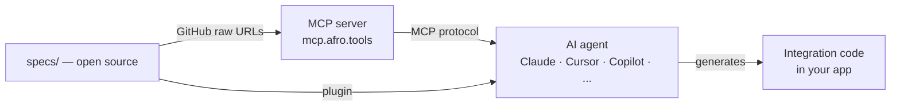

# Afro.tools — AI-ready infrastructure for African APIs

> Integrate Wave, Paycard, or Orange Money in a single prompt.

African APIs are production-grade. What's been missing is a standard,
machine-readable format that AI agents can consume directly — without
parsing documentation pages or guessing at request shapes.

Afro.tools fills that gap: a static, open-source registry of structured
specs for African APIs. Each spec is verified against the live API and
exposes exactly what an AI agent needs to generate correct integration
code on the first try.

---

## How it works



---

## What is a spec?

A spec lives at `specs/{category}/{provider}/{capability}/` and contains exactly two files:

- **`schema.json`** — ATSS-compliant description of the API capability (endpoint, auth, input/output schemas, gotchas)
- **`canonical_example.ts`** — TypeScript implementation using native fetch, compiles with `tsc --noEmit`

Each provider also has a **`provider.json`** at the root of its folder:

```
specs/payment/paycard/
├── provider.json                    ← metadata + description + example_prompt
├── create_payment/
│   ├── schema.json
│   └── canonical_example.ts
├── verify_payment/
└── webhook_payment_completed/
```

See [ATSS.md](./ATSS.md) for the full specification.

---

## Providers

<!-- tableau généré automatiquement par le pipeline — ne pas éditer manuellement -->
| Provider | Category | Country | Capabilities | Status |
|----------|----------|---------|--------------|--------|
| Paycard | payment | 🇬🇳 | 3 | ✅ AI Ready |
| Djomy | payment | 🇬🇳 | 7 | 4 verified · 3 ready |
| LengoPay | payment | 🇬🇳 | 8 | 2 verified · 6 ready |
| NimbaSMS | sms | 🇬🇳 | 11 | 📋 Ready |
| Wave | payment | 🇸🇳 🇨🇮 🇲🇱 +8 | 12 | 📋 Ready |
<!-- fin du tableau -->

**Legend:** ✅ AI Ready = all capabilities `verified` · X verified · Y ready = awaiting production validation · 📋 Ready = spec validated · 🗓 Planned = specs coming soon

---

## Use with an MCP client

### Claude Code

```bash
claude mcp add --transport http afrotools https://mcp.afro.tools/mcp
```

### Cursor / Windsurf / VS Code Copilot

```json
{
  "mcpServers": {
    "afrotools": {
      "type": "http",
      "url": "https://mcp.afro.tools/mcp"
    }
  }
}
```

---

## Claude Code plugin

```
/plugin marketplace add afrotools/afrotools
/plugin install afrotools
```

**Auto-activated skills** based on context:
- `payment` — integrating a payment API
- `sms` — integrating an SMS API
- `debug` — when an integration based on an afrotools spec fails → diagnoses whether the problem is a spec error, a missing gotcha, or an undocumented API change

**Manual commands:**
- `/afrotools:spec <provider> <capability>` — inspect a full spec
- `/afrotools:list` — list all available specs
- `/afrotools:new <category> <provider> <capability>` — scaffold a new spec

---

## Contributing

See [CONTRIBUTING.md](./CONTRIBUTING.md) to add a spec or improve an existing one.

Spec lifecycle: `draft → ready → verified`

A provider earns the **AI Ready** badge when all its capabilities reach `verified`.

---

## License

Apache 2.0 — see [LICENSE](./LICENSE).
