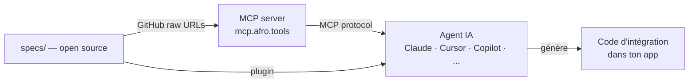

# Afro.tools — AI-ready infrastructure for African APIs

African APIs sont production-grade. Ce qui manquait : un format
machine-readable standardisé que les agents IA peuvent consommer
directement — sans parser des pages de documentation ni deviner
les shapes de requêtes.

Afro.tools comble ce vide : un registre statique, open source,
de specs structurées pour les APIs africaines. Chaque spec est
vérifiée contre l'API réelle et expose exactement ce qu'un agent
IA a besoin pour générer du code d'intégration correct du premier coup.

---

## Comment ça marche



---

## Qu'est-ce qu'une spec ?

Une spec vit dans `specs/{category}/{provider}/{capability}/` et contient deux fichiers :

- **`schema.json`** — description ATSS-compliant de la capability API (endpoint, auth, input/output schemas, gotchas)
- **`canonical_example.ts`** — implémentation TypeScript avec native fetch, compile avec `tsc --noEmit`

Chaque provider a aussi un **`provider.json`** à la racine de son dossier :

```
specs/payment/paycard/
├── provider.json                    ← metadata + description + example_prompt global
├── create_payment/
│   ├── schema.json
│   └── canonical_example.ts
├── verify_payment/
└── webhook_payment_completed/
```

Voir [ATSS.md](./ATSS.md) pour la spécification complète.

---

## Providers

<!-- tableau généré automatiquement par le pipeline — ne pas éditer manuellement -->
| Provider | Catégorie | Pays | Capabilities | Statut |
|----------|-----------|------|-------------|--------|
| Paycard | payment | 🇬🇳 | 3 | ✅ AI Ready |
| Djomy | payment | 🇬🇳 | 7 | 4 verified · 3 ready |
| LengoPay | payment | 🇬🇳 | 8 | 2 verified · 6 ready |
| NimbaSMS | sms | 🇬🇳 | 11 | 📋 Ready |
| Wave | payment | 🇸🇳 🇨🇮 🇲🇱 +8 | 12 | 📋 Ready |
<!-- fin du tableau -->

**Légende :** ✅ AI Ready = toutes les capabilities `verified` · X verified · Y ready = en attente de validation en prod · 📋 Ready = spec validée · 🗓 Planifié = specs à venir

---

## Utiliser avec un client MCP

### Claude Code

```bash
claude mcp add --transport http afrotools https://mcp.afro.tools/mcp
```

### Cursor / Windsurf / VS Code Copilot

```json
{
  "mcpServers": {
    "afrotools": {
      "type": "http",
      "url": "https://mcp.afro.tools/mcp"
    }
  }
}
```

---

## Plugin Claude Code

```
/plugin marketplace add afrotools/afrotools
/plugin install afrotools
```

**Skills auto-activés** selon le contexte :
- `payment` — intégration d'une API de paiement
- `sms` — intégration d'une API SMS
- `debug` — quand une intégration basée sur une spec afrotools échoue → diagnostique si le problème vient de la spec, d'un gotcha manquant ou d'un changement d'API non documenté

**Commandes manuelles :**
- `/afrotools:spec <provider> <capability>` — inspecter une spec complète
- `/afrotools:list` — lister toutes les specs disponibles
- `/afrotools:new <category> <provider> <capability>` — scaffolder une nouvelle spec

---

## Contribuer

Voir [CONTRIBUTING.md](./CONTRIBUTING.md) pour ajouter une spec ou améliorer une existante.

Lifecycle des specs : `draft → ready → verified`

Un provider affiche le badge **AI Ready** quand toutes ses capabilities sont `verified`.

---

## Licence

Apache 2.0 — voir [LICENSE](./LICENSE).
